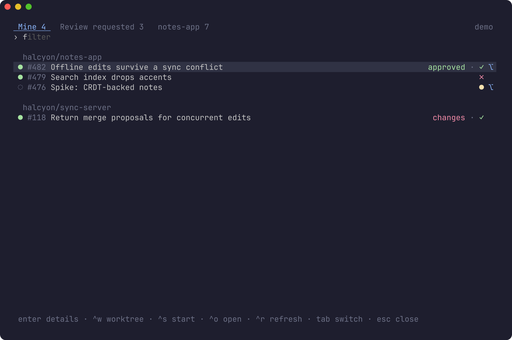
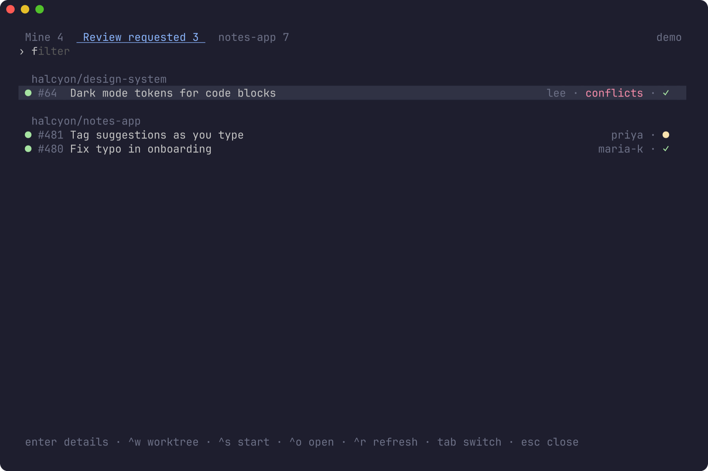
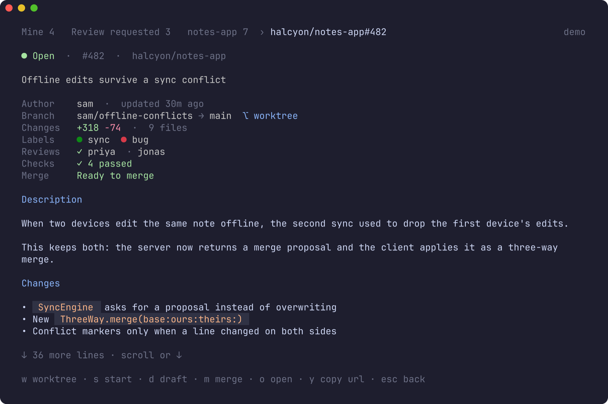
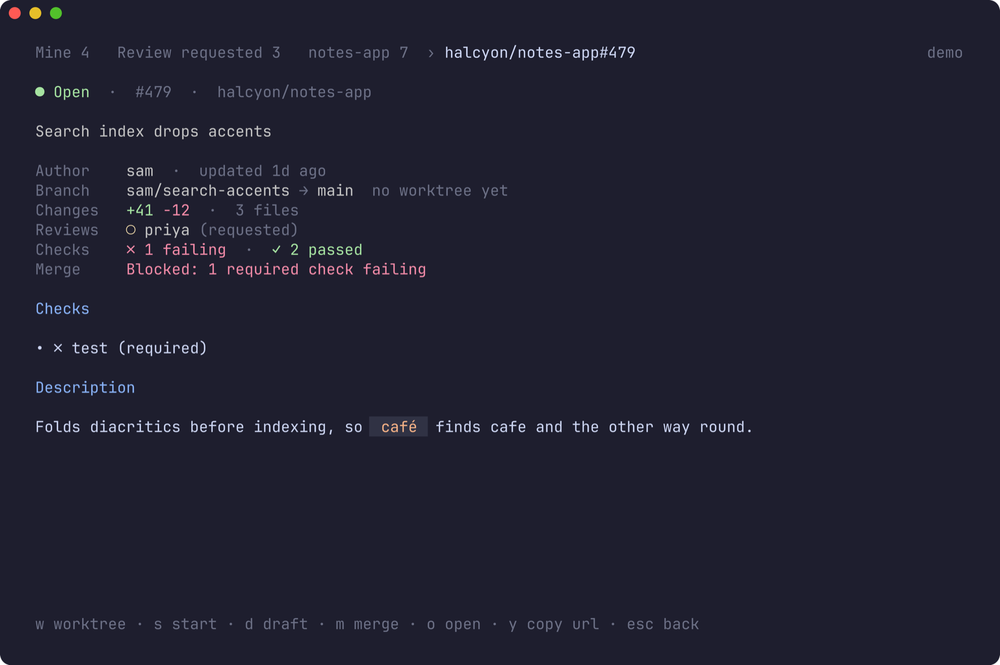
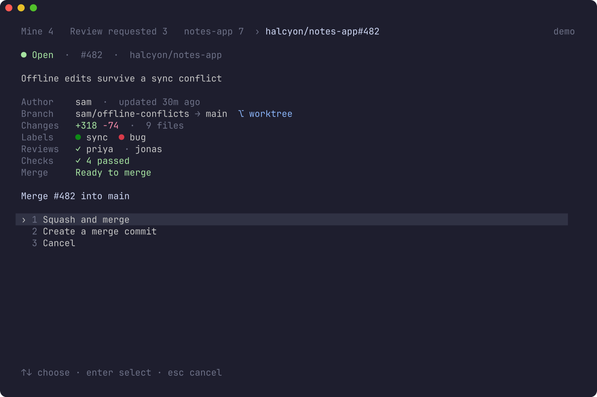

# herdr-github

Your GitHub pull requests in a [herdr](https://herdr.dev) popup. See what's
waiting on you, read a PR with its checks and reviews, flip it between draft
and ready, merge it, and land in a worktree for it (forks included) without
leaving the terminal. Every space and agent working on a PR's branch gets
the PR in the sidebar: `#482 ✓ approved`.



- **Three tabs**: *Mine* (your open PRs, every repo), *Review requested*,
  and *this repo* (all open PRs in the repo you opened it from), each with
  its state, checks (`✓ ✗ ●`), review decision, conflicts, auto-merge, and
  `⌥` where a worktree already exists.
- **PR screen**: merge readiness in one line (and why not), checks that need
  attention, reviewers, the description as Markdown, unresolved review
  threads, and the conversation.
- **Draft ↔ ready** with one key.
- **Merge** with any method the repo allows, your last one first, after a
  confirmation. Not mergeable yet? **Auto-merge** instead. Then optionally
  delete the branch and remove the worktree.
- **Worktrees**: one key opens the PR's worktree, or makes it: in the right
  repo (found by its remotes, wherever you open the popup), on the PR's
  branch, tracking it. A fork's PR comes from `refs/pull/N/head` and pushes
  back to the fork.
- **Start**: the worktree, plus a prompt for its new agent.
- **Sidebar labels**: `$pr`, `$pr_badge` and friends on every space and
  agent, kept current as you work.
- Uses **gh's sign-in**: no tokens of its own, GitHub Enterprise included.
- Keyboard first, and the mouse works. In **herdr's theme colours**.

**Contents:** [Requirements](#requirements) · [Install](#install) ·
[Try it without an account](#try-it-without-an-account) · [Use](#use) ·
[Merging](#merging) · [Worktrees](#worktrees) · [Sidebar labels](#sidebar-labels) ·
[Configuration](#configuration) · [Privacy and security](#privacy-and-security) ·
[Troubleshooting](#troubleshooting) · [How it works](#how-it-works) ·
[Development](#development)

## Requirements

- **herdr 0.9.0** or later, on **macOS**.
- **[gh](https://cli.github.com)**, signed in (`gh auth login`). The plugin
  borrows its token.
- **git**, for worktrees.
- **Go 1.26.8+** to build from source. Without Go, installing downloads a
  prebuilt binary from the matching GitHub release, checked against its
  SHA-256 checksums.

## Install

```sh
herdr plugin install mrolafsson/herdr-github
```

Then give the picker a key in `~/.config/herdr/config.toml`:

```toml
[[keys.command]]
key = "prefix+alt+g"
type = "plugin_action"
command = "herdr-github.open"
description = "GitHub: pull requests"
```

and reload with `herdr server reload-config`. Any action also runs without a
key: `herdr plugin action invoke herdr-github.open`.

> On macOS, **alt** is the Option key, and most terminals type a character
> with it (Option+G is `©`) unless it's set to act as Meta: iTerm2 →
> Profiles → Keys → Left Option key → *Esc+*; Terminal.app → Profiles →
> Keyboard → *Use Option as Meta key*; Ghostty → `macos-option-as-alt = true`.

### From a local checkout

```sh
git clone https://github.com/mrolafsson/herdr-github
sh herdr-github/scripts/build.sh
herdr plugin link "$PWD/herdr-github"
```

After changing the code, run `scripts/build.sh` again; no need to re-link.

## Try it without an account

**GitHub: demo** opens the picker on *Halcyon*, a made-up company with three
repos and a handful of PRs. Everything works (drafts toggle, PRs merge,
worktrees "open") and nothing is real: it never contacts GitHub, never runs
git, never opens a browser. The status line says what the real plugin would
have done.

```sh
herdr plugin action invoke herdr-github.demo
# or, in any terminal:
bin/herdr-github picker --demo
```

## Use

### The lists

| tab                  | shows                                                         |
|----------------------|---------------------------------------------------------------|
| **Mine**             | your open PRs across every repo, grouped by repo              |
| **Review requested** | open PRs asking for your review (or your team's)              |
| **this repo**        | every open PR in the repo you opened the popup from, drafts last |

Rows show the state (`●` open, `◌` draft), the number and title, then
`conflicts` / `changes` / `approved`, `auto` if auto-merge is on, the checks
(`✓` passed, `✗` failed, `●` running) and `⌥` if the worktree exists. The
popup reopens on the tab you left.

**Type to filter**: every word must match the number, title, repo, author,
branch or a label, so `sync bug` finds *#482 Offline edits…*.

GitHub takes a couple of seconds per page of PRs, so the popup shows the
lists from last time at once, marked *updating*, and swaps in the fresh ones
as they arrive; long lists fill in page by page (`Mine 20+`).



| key                | does                                     |
|--------------------|------------------------------------------|
| typing             | filter                                   |
| ↑ ↓, ctrl+p ctrl+n | move                                     |
| enter              | open the PR                              |
| ctrl+w             | open or create its worktree              |
| ctrl+s             | start: worktree, and a prompt for its agent |
| ctrl+o             | open on GitHub                           |
| ctrl+r             | refresh                                  |
| tab, ← →           | switch tabs                              |
| esc                | clear the filter, then close             |

### A pull request



At the top: state, title, author, branch → base (and whether its worktree
exists), size, labels, reviewers (`✓` approved, `✗` changes requested, `○`
requested), a checks summary, and **Merge**: whether it can merge now, and
if not, the reason GitHub is holding it: a required check failing, changes
requested, a missing approval, conflicts, a branch that's behind.

Below, scrolling: the checks that failed or are still running (required
ones marked), the description, unresolved review threads with their file
and line, and the conversation, oldest first.



| key            | does                                             |
|----------------|--------------------------------------------------|
| `w` or enter   | open or create the worktree                      |
| `s`            | start (see [Worktrees](#worktrees))              |
| `d`            | draft → ready for review, or back to draft       |
| `m`            | merge (see [Merging](#merging))                  |
| `o`            | open on GitHub                                   |
| `y` / `b`      | copy the URL / the local branch name             |
| ctrl+r         | reload the PR                                    |
| ↑ ↓, PgUp PgDn, space | scroll                                    |
| esc, ←         | back                                             |

### Mouse

Hover highlights a row, a click opens it, the wheel scrolls. The tabs, the
footer hints and menu items are all buttons. The popup captures the mouse, so
to select text hold **⌥** while dragging.

## Merging

`m` lists what can happen now:

- **Merge now**, with each method the repo allows (merge commit, squash,
  rebase), when GitHub says it can merge. The method you used last in this
  repo comes first; before that, the one GitHub remembers for you.
- **Auto-merge when ready**, when it can't merge yet (checks running, a
  review missing) and the repo has auto-merge turned on.
- **Turn off auto-merge**, when it's on.



Picking one asks once more, naming exactly what will happen: *Squash-merge
#482 into main now?* The merge is pinned to the commit you were looking at:
if someone pushed since the screen loaded, GitHub refuses rather than merge
code you haven't seen (press ctrl+r and look again).

A draft, a PR with conflicts, or a repo where you can't merge gets a line
saying so instead of a menu.

After a merge, the popup offers to **delete the branch** on GitHub (unless
the repo does that itself, or the branch is in someone's fork) and to
**remove the worktree**, which closes its space. Neither is forced: a
worktree with uncommitted changes stays, and the popup says why.

## Worktrees

`w` takes you to the PR's worktree as its own herdr space:

- **Already there?** It's opened and focused.
- **Not yet?** It's created with `herdr worktree create`, so your worktree
  template (say from [herdr-plus](https://github.com/cloudmanic/herdr-plus))
  runs as usual.

**Which repo.** The plugin looks for a checkout of the PR's repo:

1. `"repos"` in the config (`"owner/repo": "~/code/app"`), if you mapped it;
2. the repo you opened the popup from, and every repo herdr has a space for,
   by their git remotes: any remote pointing at the repo counts, so a fork's
   clone with an `upstream` remote does too;
3. `<clone_root>/<owner>/<repo>` (`~/code/owner/repo` by default).

With none found, it offers to clone the repo there with `gh repo clone`.

**Which branch.**

- A PR from the repo itself: its own branch, fetched fresh from the remote
  and tracking it, so `git pull` and `git push` just work.
- A PR from a fork: `<fork owner>/<branch>` (say `alice/fix-typo`), so it
  can't collide with a branch of your own, fetched from `refs/pull/N/head`,
  and set to pull from and push to the fork (as `gh pr checkout` does; pushing
  works when the author lets maintainers edit).
- A local branch of that name already there (from a worktree you removed)
  is checked out as it is, never reset, so commits on it aren't lost.

### Start

`s` (ctrl+s in the list) opens the worktree and then types a prompt into the
new worktree's agent once it's ready (your worktree template starts it). By
default:

> Pull request {url} is checked out here. Read it with `gh pr view {number}
> --comments`, look at any failing checks, and tell me what's left to do.

Set your own with `start_prompt` (`{number}`, `{url}`, `{repo}`, `{branch}`
and `{title}` are filled in), for example `"/review-pr {url}"` for a Claude
Code skill of that name. Think twice before `{title}`: anyone who can open a
PR writes it, and the agent will read it as instructions.

Only a **new** worktree's own pane is prompted: an existing worktree's agent
may be mid-task. It waits up to `agent_wait_seconds` (90) for the agent, and
waits out a trust or approval dialog for you to answer. This runs in the
background after the popup closes; `background.log` in
`~/.local/state/herdr/plugins/herdr-github/` records what happened, not the
prompt.

## Sidebar labels

The plugin puts the PR of each space's branch on the space, and on each agent
pane in it, as herdr tokens. herdr only shows tokens you ask for, so add them
to your sidebar rows in `~/.config/herdr/config.toml`:

```toml
[ui.sidebar.spaces]
rows = [
  ["state_icon", "workspace", "$pr_badge"],
  ["branch", "git_status"],
]

[ui.sidebar.agents]
rows = [["state_icon", "pane", "$pr"], ["workspace"]]
```

```
  ● ACT-1638 Discover catalog  #1049 draft ✗
    act-1638-discover-catalog
```

| token        | example                        |
|--------------|--------------------------------|
| `$pr`        | `#482`                         |
| `$pr_badge`  | `#482 ✓ approved`, `#476 draft ●`, `#64 ✓ conflicts`, `#118 merged`, `… auto` |
| `$pr_state`  | `open`, `draft`, `merged`, `closed` |
| `$pr_checks` | `✓`, `✗`, `●` (open PRs)       |
| `$pr_review` | `approved`, `changes requested`, `needs review` (open PRs) |

Style them like any token, e.g. `{ token = "$pr_badge", dim = true }`.

**How it stays current.** herdr runs `herdr-github tick` at startup and on
its events: switching space or pane, an agent changing state (often a push),
a space or worktree being created or opened. A tick within 3 seconds of the
last does nothing; otherwise it reads each space's branch from git and asks
GitHub, in one query per repo, only about branches whose answer is older than
`label_refresh_seconds` (60). The popup refreshes them straight after you
change a PR. **GitHub: refresh PR labels** does it on demand.

**Which PR.** The one for the branch the space is on, or the branch it pushes
to (its upstream), from the repo's `upstream` remote, else `origin`. An open
PR wins over closed ones; a fork's PR is matched to its fork's owner. The
default branch and `main`/`master` are skipped. When GitHub can't be reached,
labels keep what they last showed; they expire after two hours without a
tick.

Turn them off with `"labels": false` (the next tick clears them).

## Configuration

Everything is optional. Put `config.json` in the plugin's config directory
(`herdr plugin config-dir herdr-github`, usually
`~/.config/herdr/plugins/config/herdr-github`):

```json
{
  "hosts": ["github.com", "github.example.com"],
  "repos": { "acme/app": "~/work/app" },
  "clone_root": "~/code",
  "start_prompt": "/review-pr {url}",
  "agent_wait_seconds": 90,
  "labels": true,
  "label_refresh_seconds": 60,
  "theme": "dark"
}
```

| key                     | default          | what it does |
|-------------------------|------------------|--------------|
| `hosts`                 | `["github.com"]` | Hosts the Mine and Review tabs search, e.g. add your GitHub Enterprise host. Sign in to each with `gh auth login --hostname …`. |
| `repos`                 | none             | `"owner/repo"` (or `"host/owner/repo"`) → checkout, for one the plugin can't find by its remotes (an SSH host alias, say). |
| `clone_root`            | `~/code`         | Where a repo with no checkout is cloned, as `<clone_root>/<owner>/<repo>`, after asking. |
| `start_prompt`          | see [Start](#start) | What **start** types into the new worktree's agent. |
| `agent_wait_seconds`    | `90`             | How long **start** waits for that agent. |
| `labels`                | `true`           | The sidebar tokens. |
| `label_refresh_seconds` | `60`             | How old a branch's PR status may get before a herdr event asks GitHub again. |
| `theme`                 | asks the terminal | `dark` or `light`, if the automatic choice is wrong. |

A copy is in [`config.example.json`](config.example.json). Colours follow
herdr's own `[theme]`, as in
[herdr-linear](https://github.com/mrolafsson/herdr-linear#colours).

## Privacy and security

**What leaves your machine.** GraphQL requests to GitHub (`api.github.com`,
or `https://<host>/api/graphql` for Enterprise), and `git fetch` / `gh repo
clone` for worktrees. Nothing else: no analytics, no telemetry.

**Sign-in.** The plugin asks `gh auth token` for each host when it needs one
(`GH_TOKEN`/`GITHUB_TOKEN`, or `GH_ENTERPRISE_TOKEN` for Enterprise, win if
set, as they do for gh). It keeps no token: nothing is written to disk or
passed on a command line. Signing out of gh signs it out too.

**What's written to GitHub**, and only when you press the key and, for
merges, confirm: draft/ready, merge, auto-merge on/off, deleting a merged
PR's branch.

**What's kept locally**, in `~/.local/state/herdr/plugins/herdr-github/`,
readable only by you: `lists.json` (the last lists, shown while fresh ones
load: numbers, titles, branches, states), `labels.json` (each branch's PR
status, for the labels), `prefs.json` (your last tab, your merge method per
repo) and the background log.

**Text from GitHub.** Titles, bodies, comments, names and labels are written
by other people, so every string has terminal escape sequences and control
characters removed on arrival, and every frame is checked again before it's
drawn. A PR title can't rewrite your clipboard, retitle your terminal or fake
what's on screen. Branch names go to GitHub as GraphQL variables, never
spliced into a query. "Open on GitHub" only opens `https` links on your
configured hosts.

## Troubleshooting

**The key does nothing.** `herdr plugin action invoke herdr-github.open`
tells you whether the plugin works. If it does, it's the key: with
`prefix+alt+g`, turn on your terminal's Option-as-Meta setting (see
[Install](#install)); otherwise check herdr doesn't already use it.

**"GitHub isn't connected".** gh has no working sign-in for that host. Press
enter in the popup to run `gh auth login` there, or run
`gh auth status` / `gh auth refresh` yourself. `bin/herdr-github status`
shows what the plugin sees.

**No labels in the sidebar.** Add the tokens to your rows (see
[Sidebar labels](#sidebar-labels)) and reload the config. Then
`herdr plugin action invoke herdr-github.labels` refreshes them and toasts
what went wrong, if anything. A space on `main`, or on a branch with no PR,
has none.

**"no checkout of owner/repo found".** Open the popup from inside the repo,
let it clone, or map it under `"repos"`. A remote using an SSH host alias
(`git@work-github:owner/repo`) isn't recognised as GitHub; map it.

**Merging says the head branch was modified.** Someone pushed after you
opened the PR. ctrl+r, look, and merge again.

**The agent didn't get the prompt.** See `background.log` (under
[Start](#start)). Usually: the worktree already existed, no agent starts in
new worktrees, or it took longer than `agent_wait_seconds`.

**The popup opens and closes at once.** Look in
`herdr plugin log list --plugin herdr-github`, and rebuild with
`scripts/build.sh`. `HERDR_GITHUB_DEBUG=/tmp/gh.log` logs the list loads.

## How it works

herdr plugins are commands plus popups. **GitHub: pull requests** runs
`herdr-github action open`, which opens the plugin's `picker` pane as a popup
with the invoking space's directory; the popup is the same binary running a
[Bubble Tea](https://github.com/charmbracelet/bubbletea) interface.

- **GitHub**: GraphQL over HTTPS with gh's token. One search per tab and
  page, one query per PR screen, one per repo for the labels.
- **herdr**: its local socket: `worktree.list/create/open/remove`,
  `workspace.list` and `pane.list` to find checkouts and spaces,
  `workspace.report_metadata` and `pane.report_metadata` for labels,
  `plugin.pane.open` for the popup, `agent.prompt` for start.
- **Start** and the post-change label refresh run detached, so the popup can
  close.

| file           | what's in it                                           |
|----------------|--------------------------------------------------------|
| `main.go`      | commands and actions                                   |
| `github.go`    | gh token, GraphQL queries and mutations                |
| `source.go`    | the tabs' searches across hosts, paging                |
| `repos.go`     | remotes, finding a repo's checkout, cloning            |
| `worktree.go`  | PR worktrees (forks too), start, removal               |
| `labels.go`    | the sidebar tokens (`tick`)                            |
| `tui.go`       | lists, tabs, filter, menus                             |
| `detail.go`    | the PR screen, draft, merge and clean-up               |
| `cache.go`, `prefs.go` | the lists from last time, remembered choices   |
| `markdown.go`, `sanitize.go`, `theme.go`, `mouse.go` | rendering, safety, colours, mouse |
| `demo.go`      | the fictional demo org                                 |

## Development

```sh
sh scripts/build.sh                 # build bin/herdr-github
go test ./...                       # the suite
bin/herdr-github picker --demo      # the picker in any terminal
sh scripts/screenshots.sh           # docs/images from the demo (needs freeze)
```

The tests cover the GraphQL client against a fake GitHub (paging, errors,
sign-in, merge pinning, variables not splicing), every screen and key on the
demo, the mouse, the list cache, and, on real temporary git repositories
with a stand-in herdr, finding checkouts, worktrees for same-repo and fork
PRs, and the labels tick from branch to token.

Releasing works as in herdr-linear: bump `version` in `herdr-plugin.toml`,
move the `CHANGELOG.md` entry, commit, and push a matching `v` tag.

## License

MIT. See [LICENSE](LICENSE).
